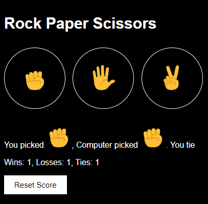

# MINI PROJECT 
*Đây là project được thiết kế bởi ngôn ngữ JavaScript, nhằm để ứng dụng kiến thức để xây dựng game tuổi thơ ***Rock-Paper-Scissors****

---
# I. GIỚI THIỆU

---

## 1. Tác giả
**Họ và tên** : Hoàng ngọc
**Mã số sinh viên** : 23120146
**Lớp** : 23CTT2
**Trường** : Đại học Khoa Học Tự Nhiên

## 2. Cách cài đặt

Được xây dựng và thiết trên Visual Code. Để có thể trải nghiệm trò chơi thì hãy làm theo các bước sau

- Bước 1: Tải mã nguồn về máy
- Bước 2: Mở Visual Code và chọn mở foler mã nguồn
- Bước 2: Click chuột phải và chọn "Open in live sever" và trải nghiệm.

## 3. Hướng dẫn chơi
- Bạn chọn một trong các lựa chọn **Rock** hoặc **Paper** hoặc **Scissors**.
- Sau đó máy tính sẽ chọn ngẫu nhiên các lựa chọn trên để "đấu" với bạn
- **Rock** thắng **Scissors**, **Paper** thắng **Rock** và **Scissors** thắng **Paper**.
- Hệ thống sẽ ghi điểm mỗi lần bạn chơi và bạn có thể chọn **Reset score** để làm mới.
## 4. Các chức năng

- Giao diện thân thiện, hiển thị đầy đủ, thao tác chỉ cần bấm chuột.
- Hệ thống ghi điểm và lưu trữ vào local Storage.
- Chức năng Reset score khi cần chơi ván mới.

## 5. Xây dựng bởi
- Công cụ: Visual Code.
- Ngôn ngữ: JavaScript, HTML, CSS.
- Hệ điều hành: Window 10.

---

# II. CHI TIẾT VỀ DỰ ÁN

---

## 2. Về mã nguồn

- File `README.md` để hướng dẫn người dùng sử dụng.
- Folder `images` chứa các ảnh.
- File `UI_project.html` chứa các Elements để hiển thị giao diện người dùng.
- File `styles.css` để thiết kế giao diện.
- File `r_p_s_project.js` để chứa các đoạn mã nguồn dùng để tương tác với người dùng. 

## 3. GIAO DIỆN GAME

 
